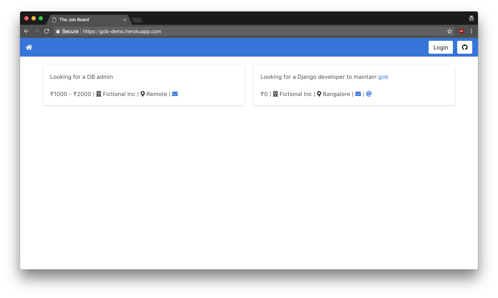
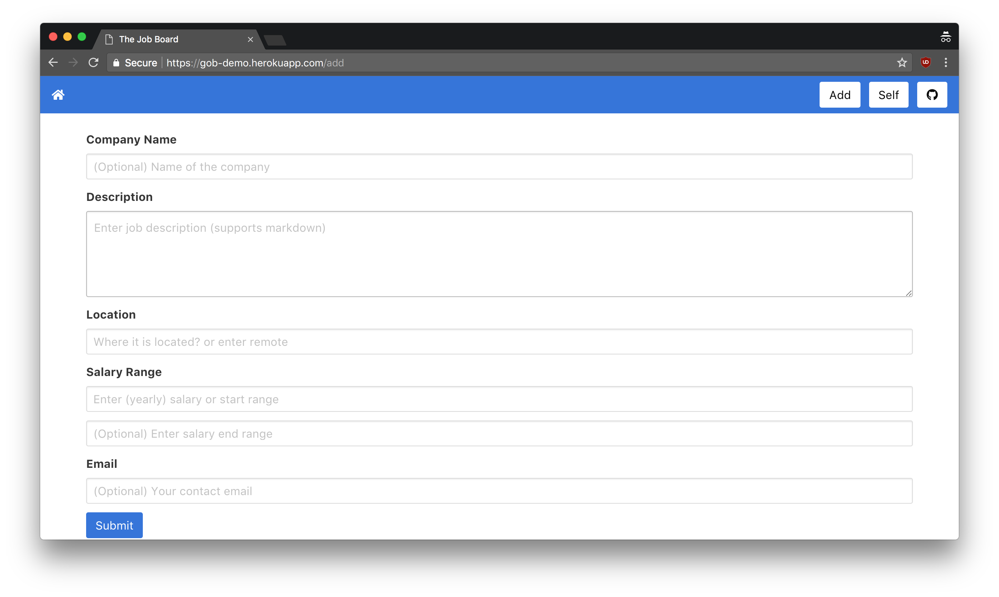

# gob

gob is a very simple job board written in Django.

- gob is based on minimalism. All job descriptions are restricted to 160 characters.
- Requires no sign-up and works with either Reddit or Slack using OAuth
- Can be installed on Heroku with a single click

## Screenshots

Homepage:

Form:

## Installation

gob uses [django-allauth](https://github.com/pennersr/django-allauth) for social login. You can set `OAUTH_LOGIN_PROVIDER` env to specify either `reddit` or `slack`. If you chose to use Slack, then you need your Slack team ID and also team slug (which is the first part of your Slack team URL). 

To install, click on Heroku icon and set the environment variables accordingly. Once installed, login to the Django admin panel and make sure to add Social Application for the OAuth provider you wish to use (usually at `https://<your-app>.herokuapp.com/admin/socialaccount/socialapp/`)

## Name

Named after [Gob Bluth](https://en.wikipedia.org/wiki/List_of_Arrested_Development_characters#Primary_characters). Should be pronounced as 'jobe'.

## License

The mighty MIT license. Please check `LICENSE` for more details.